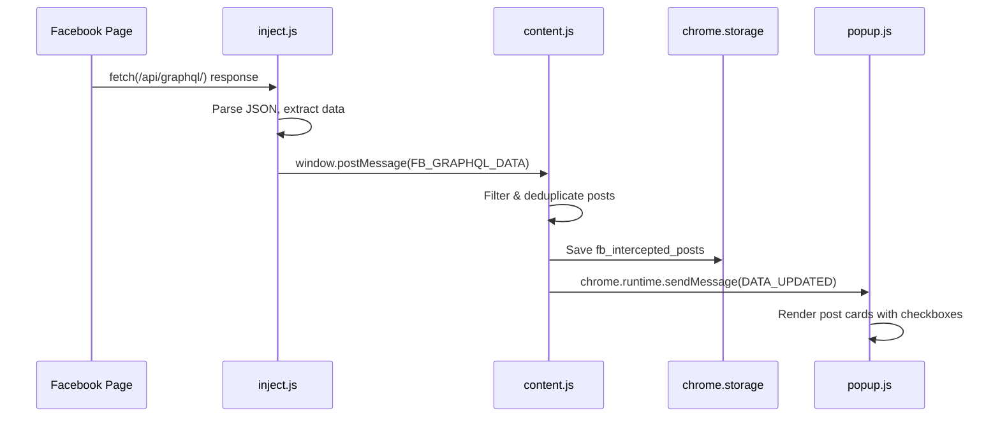
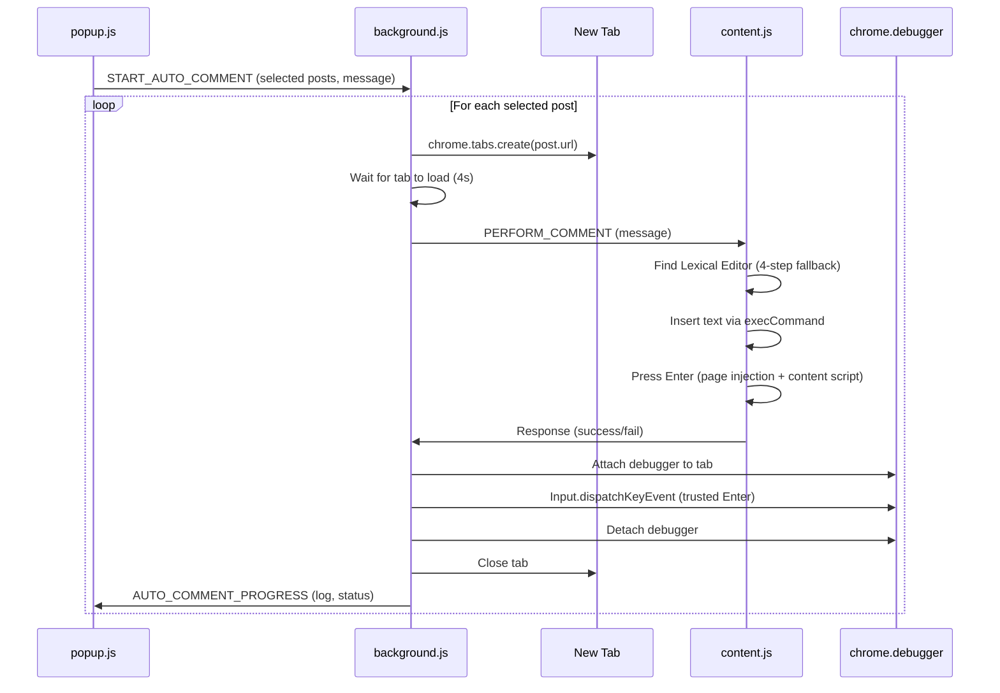
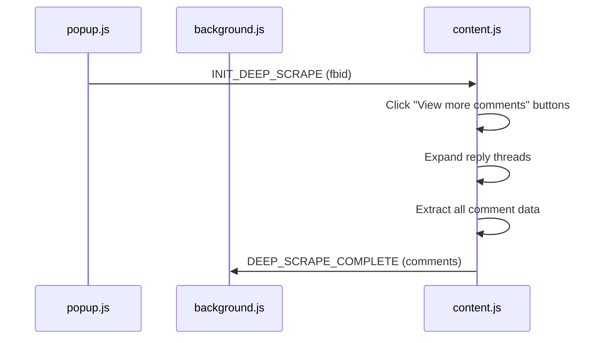

# Facebook Group Scraper — Chrome Extension

> Chrome Extension untuk scraping postingan grup Facebook secara otomatis, ekspor data ke CSV, dan auto-comment/reply dengan mekanisme interaksi DOM yang robust.

---

## 📋 Daftar Isi

- [Fitur Utama](#-fitur-utama)
- [Arsitektur Sistem](#-arsitektur-sistem)
- [Struktur File](#-struktur-file)
- [Alur Kerja Sistem](#-alur-kerja-sistem)
- [Instalasi](#-instalasi)
- [Penggunaan](#-penggunaan)
- [Teknologi & Mekanisme](#-teknologi--mekanisme)
- [Catatan Teknis Penting](#-catatan-teknis-penting)

---

## ✨ Fitur Utama

| Fitur | Deskripsi |
|-------|-----------|
| **GraphQL Interceptor** | Menyadap response API GraphQL Facebook secara real-time via `fetch` dan `XMLHttpRequest` override |
| **Post Scraping** | Mengekstrak data postingan: author, konten teks, jumlah like/comment/share, timestamp, URL |
| **Deep Comment Scrape** | Membuka postingan individual dan meng-scrape seluruh komentar beserta balasan |
| **Filter & Sort** | Pencarian teks, sortir berdasarkan terbaru/like/comment |
| **Export CSV** | Mengekspor data postingan ke file CSV |
| **Auto Comment** | Komentar otomatis pada postingan terpilih menggunakan Lexical Editor interaction |
| **Auto Reply** | Balasan otomatis pada komentar berdasarkan keyword |
| **Post Selection** | Checkbox untuk memilih postingan mana yang akan diproses auto-comment |
| **Progress Tracking** | Status progress real-time dengan log detail |
| **Cancellation Support** | Proses auto-comment bisa dihentikan kapan saja |

---

## 🏗 Arsitektur Sistem

```
┌─────────────────────────────────────────────────────────────┐
│                     Chrome Extension                         │
│                                                              │
│  ┌──────────┐    ┌──────────────┐    ┌───────────────────┐  │
│  │ popup.js │◄──►│ background.js│◄──►│   content.js      │  │
│  │ popup.html│   │ (Service     │    │ (Content Script)  │  │
│  │ styles.css│   │  Worker)     │    │                   │  │
│  └──────────┘    └──────┬───────┘    │  ┌─────────────┐  │  │
│                         │            │  │  inject.js   │  │  │
│                         │            │  │ (Page Script)│  │  │
│                         │            │  └──────┬──────┘  │  │
│                         │            └─────────┼─────────┘  │
│                         │                      │            │
│              chrome.debugger API        GraphQL Intercept   │
│              (Trusted Enter Key)        (fetch/XHR hook)    │
└─────────────────────────────────────────────────────────────┘
                                              │
                                    ┌─────────▼─────────┐
                                    │   Facebook.com    │
                                    │  /api/graphql/    │
                                    └───────────────────┘
```

### Komunikasi Antar Komponen

| Dari | Ke | Mekanisme | Pesan |
|------|----|-----------|-------|
| `inject.js` | `content.js` | `window.postMessage` | `FB_GRAPHQL_DATA` |
| `content.js` | `popup.js` | `chrome.runtime.sendMessage` | `DATA_UPDATED` |
| `popup.js` | `background.js` | `chrome.runtime.sendMessage` | `START_AUTO_COMMENT`, `STOP_AUTO_COMMENT` |
| `background.js` | `content.js` | `chrome.tabs.sendMessage` | `PERFORM_COMMENT`, `INIT_DEEP_SCRAPE` |
| `background.js` | Tab | `chrome.debugger` | `Input.dispatchKeyEvent` (trusted Enter) |
| Semua | Storage | `chrome.storage.local` | Data postingan, log |

---

## 📁 Struktur File

```
extension/
├── manifest.json          # Manifest V3, permissions, content script config
├── background.js          # Service Worker: auto-comment orchestration, debugger API
├── content.js             # Content Script: DOM interaction, scraping, comment execution
├── inject.js              # Page Script: GraphQL fetch/XHR interceptor
├── popup.html             # UI: tab layout, post list, auto-comment panel
├── popup.js               # UI Logic: display posts, selection, trigger actions
├── popup_new_functions.js # Experimental/new UI functions
├── styles.css             # UI Styling: dark theme, glassmorphism
├── icons/                 # Extension icons
├── dialog-comment.html    # DOM reference: Facebook comment dialog structure
├── sample-dom.html        # DOM reference: Facebook feed structure
├── sample-response-*.txt  # API response samples for development
└── README.md              # Dokumentasi ini
```

---

## 🔄 Alur Kerja Sistem

### 1. Scraping Postingan



### 2. Auto Comment



### 3. Deep Comment Scrape



---

## 🚀 Instalasi

### Prasyarat
- Google Chrome versi 88+
- Mode Developer aktif di Chrome Extensions

### Langkah-langkah

1. **Clone repository**
   ```bash
   git clone https://github.com/nirwanaz/fb-scraper.git
   ```

2. **Buka Chrome Extensions**
   - Navigasi ke `chrome://extensions/`
   - Aktifkan **Developer mode** (toggle kanan atas)

3. **Load Extension**
   - Klik **"Load unpacked"**
   - Pilih folder `extension/`

4. **Navigasi ke Grup Facebook**
   - Buka grup Facebook manapun
   - Klik ikon extension di toolbar Chrome

---

## 📖 Penggunaan

### Scraping Postingan

1. Buka halaman grup Facebook di Chrome
2. Klik ikon extension → Tab **"Posts"**
3. (Opsional) Masukkan target jumlah post di field input
4. Klik **"Start"** → Scroll halaman otomatis
5. Data postingan akan muncul secara real-time
6. Gunakan filter/sort untuk menyaring data
7. Klik **"Export"** untuk mengunduh CSV

### Auto Comment

1. Pastikan sudah ada data postingan yang di-scrape
2. Pindah ke tab **"Auto Comment"**
3. ✅ Centang postingan yang ingin dikomentari (atau "Select All")
4. Tulis pesan komentar di textarea
5. Atur delay antar postingan (detik)
6. Klik **"Start Auto Comment (N posts)"**
7. Konfirmasi di dialog yang muncul
8. Pantau progress di log panel
9. Klik **"Stop"** untuk membatalkan

### Auto Reply (Mode Keyword)

1. Aktifkan mode Reply di panel Auto Comment
2. Masukkan keyword yang akan di-match (misal: "harga", "link", "beli")
3. Tulis template balasan
4. Sistem akan otomatis membalas komentar yang mengandung keyword tersebut

---

## ⚙ Teknologi & Mekanisme

### GraphQL Interception

Extension ini menyadap API internal Facebook dengan cara:

```javascript
// inject.js — Berjalan di konteks halaman Facebook
const ORIGINAL_FETCH = window.fetch;
window.fetch = async (...args) => {
  const response = await ORIGINAL_FETCH(...args);
  if (url.includes('/api/graphql/')) {
    // Parse & kirim data ke content script
  }
  return response;
};
```

**Mengapa?** Facebook menggunakan GraphQL API untuk memuat data feed. Dengan menyadap response, kita mendapat data terstruktur tanpa perlu parsing DOM.

### Lexical Editor Interaction

Facebook menggunakan **Lexical Editor** (bukan Draft.js) untuk kotak komentar:

```html
<!-- Struktur DOM kotak komentar Facebook -->
<div 
  aria-label="Comment as Username"
  contenteditable="true"
  role="textbox"
  data-lexical-editor="true"
  aria-placeholder="Comment as Username">
  <p dir="auto"><br></p>
</div>
```

**Mekanisme input teks:**

| Metode | Trusted? | Digunakan Sebagai |
|--------|----------|-------------------|
| `document.execCommand('insertText')` | ✅ Ya | **Primary** — menghasilkan trusted `beforeinput` event |
| `ClipboardEvent('paste')` | ❌ Tidak | **Fallback 1** — simulasi paste |
| Direct DOM (`p.textContent = text`) | ❌ Tidak | **Fallback 2** — manipulasi langsung |

**Mekanisme pengiriman (Enter key):**

| Metode | Trusted? | Digunakan Sebagai |
|--------|----------|-------------------|
| `chrome.debugger` → `Input.dispatchKeyEvent` | ✅ Ya | **Primary** — dari background.js |
| Page-context `<script>` injection | ❌ Tidak | **Fallback 1** — dari content.js |
| Direct `KeyboardEvent` dispatch | ❌ Tidak | **Fallback 2** — dari content.js |

> ⚠️ Facebook **tidak memiliki tombol Send/Kirim** untuk komentar. Satu-satunya cara mengirim komentar adalah menekan Enter.

### Chrome Debugger API

Untuk mengatasi masalah `isTrusted: false` pada keyboard events, extension menggunakan Chrome Debugger API:

```javascript
// background.js — Mengirim trusted Enter key
chrome.debugger.attach({ tabId }, '1.3', () => {
  chrome.debugger.sendCommand({ tabId }, 'Input.dispatchKeyEvent', {
    type: 'keyDown',
    key: 'Enter',
    code: 'Enter',
    windowsVirtualKeyCode: 13
  });
});
```

---

## ⚠ Catatan Teknis Penting

### 1. Trusted vs Untrusted Events

Keyboard events yang dibuat dengan `new KeyboardEvent()` memiliki `isTrusted: false` dan mungkin diabaikan oleh Facebook. Hanya `chrome.debugger` API yang bisa menghasilkan trusted events.

### 2. Content Script URL Matching

Content script berjalan pada:
- `https://*.facebook.com/groups/*` — Halaman feed grup
- `https://*.facebook.com/permalink.php*` — Halaman postingan individual
- `https://*.facebook.com/*/posts/*` — URL postingan langsung

### 3. Facebook DOM yang Dinamis

Facebook sering mengubah class names (menggunakan CSS-in-JS yang ter-obfuscate). Selektor yang digunakan extension ini berbasis **atribut semantik** yang lebih stabil:
- `role="textbox"` 
- `contenteditable="true"`
- `data-lexical-editor="true"`
- `aria-label="Comment as ..."`
- `aria-label="Leave a comment"`

### 4. Rate Limiting

Untuk menghindari deteksi spam oleh Facebook:
- Delay default: 10 detik antar postingan
- Delay random tambahan: 0-5 detik
- Tab dibuka secara background (`active: false`)

### 5. Debugger Banner

Saat `chrome.debugger` aktif, Chrome menampilkan banner kuning **"Extension is debugging this browser"** di atas halaman. Ini normal dan tidak bisa dihilangkan.

---

## 📄 Lisensi

Private — Hanya untuk penggunaan internal.
